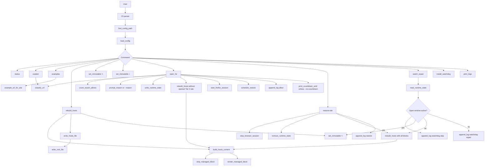
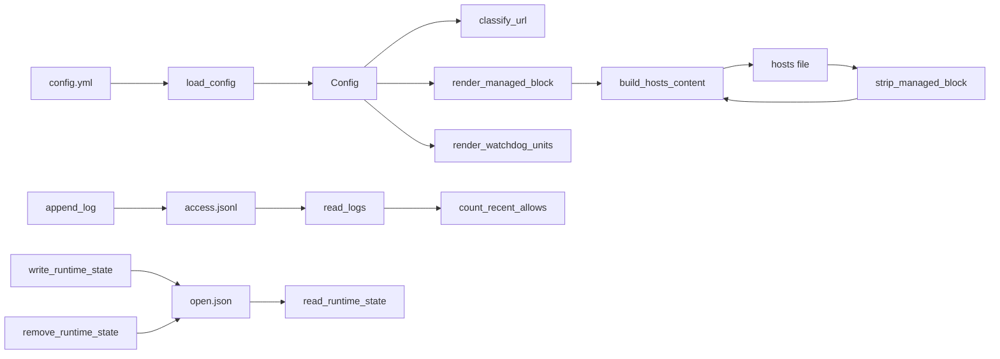

# Implementation and Test Map

This document maps the Rust application structure and the current automated tests.

## Application Flow

## Data Flow

## Test Coverage Map

```mermaid
flowchart TD
    Tests[Unit tests in src/main.rs] --> ClassificationTests[URL classification]
    Tests --> HostsTests[Hosts block rendering]
    Tests --> ConfigTests[Config parsing]
    Tests --> LogTests[Log handling]
    Tests --> RuntimeTests[Runtime state parsing]
    Tests --> WatchdogTests[Watchdog unit rendering]
    Tests --> HelperTests[Utility helpers]
    Tests --> CliTests[CLI integration tests]

    ClassificationTests --> classify_url
    ClassificationTests --> domain_matches
    ClassificationTests --> normalize_domain

    HostsTests --> strip_managed_block
    HostsTests --> render_managed_block
    HostsTests --> build_hosts_content

    ConfigTests --> load_config
    ConfigTests --> expand_tilde
    ConfigTests --> find_config_path

    LogTests --> read_logs
    LogTests --> count_recent_allows

    RuntimeTests --> read_runtime_state

    WatchdogTests --> render_watchdog_units

    HelperTests --> sanitize_name
    HelperTests --> systemd_quote

    CliTests --> cli_explain
    CliTests --> cli_status
    CliTests --> cli_examples
    CliTests --> cli_logs
```

## Current Test List

| Test | Covers |
| --- | --- |
| `classifies_tiers` | Tier 1, Tier 2, and unknown URL classification |
| `classifies_subdomains_and_rejects_similar_domains` | Subdomain matching without false positives |
| `rejects_invalid_or_hostless_urls` | Invalid URL handling |
| `accepts_urls_without_an_explicit_scheme` | Helpful URL parsing for inputs like `old.reddit.com/r/rust` |
| `normalizes_domain_text_for_configured_domains` | Domain cleanup for config values |
| `tier2_example_urls_are_configurable_with_a_safe_fallback` | Tier 2 example URL output |
| `strips_existing_managed_block` | Removing an existing managed hosts block |
| `strips_only_managed_content_and_keeps_surrounding_lines` | Preserving unmanaged hosts lines |
| `render_managed_block_contains_all_configured_blocks` | Full managed block rendering |
| `render_omits_temporarily_allowed_tier2_site` | Temporary Tier 2 omission during `open-for` |
| `build_hosts_content_preserves_unmanaged_lines_and_replaces_old_block` | Hosts rebuild content generation |
| `build_hosts_content_can_render_only_the_managed_block` | Empty hosts file rendering |
| `load_config_applies_defaults_normalization_and_maximum_window` | YAML parsing, defaults, normalization, and max-minute clamping |
| `load_config_expands_tilde_paths` | `~` path expansion |
| `explicit_config_path_wins` | Explicit config path selection |
| `read_logs_returns_empty_when_missing` | Missing log file behavior |
| `read_logs_skips_malformed_lines` | Corrupt historical JSONL lines do not break commands |
| `count_recent_allows_filters_action_and_time_window` | Rolling-hour `open-for` limit input |
| `read_runtime_state_handles_missing_empty_and_valid_files` | Runtime state parsing |
| `utility_helpers_make_safe_names_and_systemd_values` | Safe names, systemd quoting, and countdown formatting |
| `render_watchdog_units_points_to_hosts_file_and_repair_command` | Generated systemd watchdog units |

## CLI Integration Tests

| Test | Covers |
| --- | --- |
| `cli_explain_classifies_tier2_url` | Compiled binary `explain` command |
| `cli_status_prints_tier2_examples` | Compiled binary `status` output with example URLs |
| `cli_examples_prints_quoted_open_for_commands` | Compiled binary `examples` command |
| `cli_logs_skips_malformed_historical_lines` | Compiled binary `logs` command with malformed JSONL tolerance |

## Untested Boundaries

These behaviors are intentionally not covered by unit tests because they require privileged or desktop side effects:

- Running `chattr`.
- Writing the real `/etc/hosts`.
- Calling `sudo`.
- Launching Firefox.
- Scheduling `systemd-run`.
- Installing or removing systemd units.

Those should be covered later with a separate integration test harness, probably using temporary files, a fake command runner, and mocked Firefox/systemd commands.
